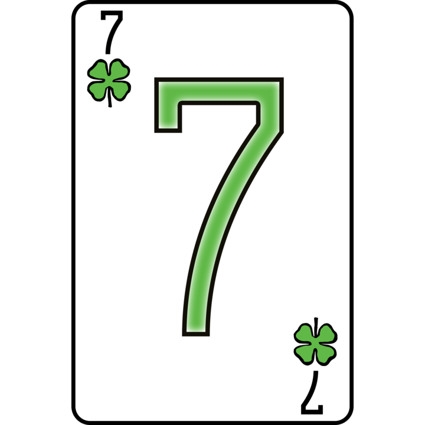

# Team 7 - Sevens on the Stack

## [Group Video](videos/teamintro.mp4)

## Roster
* Ashton Simbol - [Github Page](https://ashsensei.github.io/User-Page/)
  * 3rd Year CS student with a love for product management, education, and helping others
* Karim Barajas - [Github Page](https://kbarajas5432.github.io/CSE110Repo/)
  * 4th Year CS student who likes working out and also interested in game development, software engineering, and also Quantative Finance
* Guthry Hahm - [Github Page](https://guthryhahm.github.io/userPage/)
  * 3rd Year CSE major, photography enthusiast, with an interest in computer graphics
* Eric Nguyen (he/him) - [Github Page](https://github.com/nericguyen)
  * 2nd Year CS major who doesn't really know what he's doing yet.
* Tanner Berman - [Github Page](https://bermantanner.github.io/tannerberman/)
  * 3rd Year CS student, desire to build impactful software, loves guitar
* Max Huang - [Github Page](https://max-dwd.github.io/userPage/)
  * 3rd year CS student who likes fitness and thinking about human mind.
* Preity Singh - [Github Page](https://preity-singh.github.io/Lab1-110/)
  * 2nd Year CS major who loves reading, the outdoors, and is interested in how tech meets people's needs.
* Graydon Leongkaye - [Github Page](https://graydon759.github.io/Github-Pages-Project/)
  * 3rd Year CS student, relatively new to coding, interested in video game development
* Luis Guerrero Escoto - [Github Page](https://luisisawayy.github.io/110_lab1/)
  * 3rd year CSE major, enjoyer of UFC and Soccer, and also abundantly interested in Computing
* Jonathan Renteria - [Github Page](https://j2renteriaucsd.github.io/UserPage/)
  * 2nd Year CE major with a love for game development and cats
* Vishruth Bharath - [Github Page](https://vishruthb.github.io/cse110-test-repo/)
  * 3rd Year CS student who likes to code, interested in ML and systems

## [To README](../README.md)